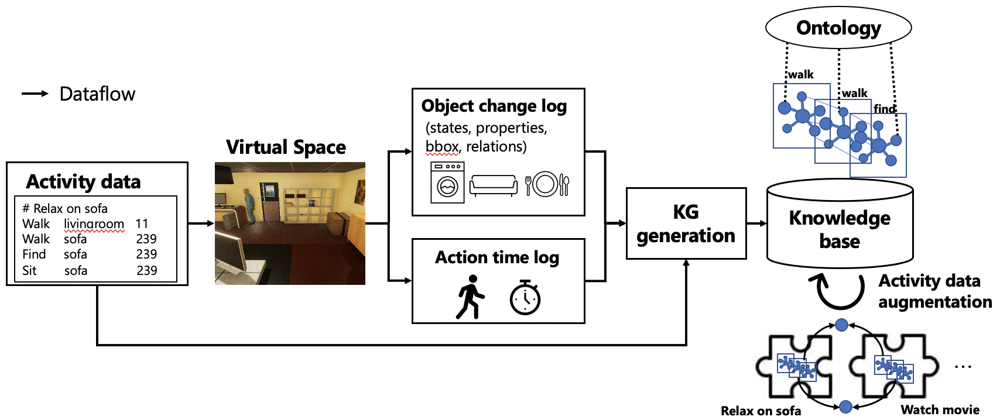

# VirtualHome2KG
[[Japanese]](./README_ja.md)

VirtualHome2KG is a system for constructing and augmenting knowledge graphs (KGs) of daily living activities using virtual space. We also provide an ontology to describe the structure of the KGs.
We used [VirtualHome](http://virtual-home.org/) as a platform of virtual space simulation. Thus, this repository is an extension of the [virtualhome](https://github.com/xavierpuigf/virtualhome).
Please see the original repository of the [virtualhome](https://github.com/xavierpuigf/virtualhome) for details of the Unity simulation. 

## Contents
1. Overview
2. Set Up
3. How to use
4. Schema
<!--5. Knowledge graphs-->

## Overview



## Versions
- [Beta version](https://github.com/aistairc/VirtualHome2KG/):  new schema (Event-centric. [more information](https://doi.org/10.1109/ACCESS.2023.3253807))  
- [stable version](https://github.com/aistairc/VirtualHome2KG/tree/bcfa5b7b06af046c70d7d41c454ad7f9610ecbd2): old schema (Activity-centric. presented at ISWC2021 Poster, ICTAI2021 Short paper)

## Set Up

```bash
git clone https://github.com/aistairc/virtualhome2kg.git
```
We provide VirtualHome2KG as [Jupyter](https://jupyter.org/) notebooks. If you want to run the tools, install Jupyter and run it on your host.
<br/>
First of all, you need to build an environment where VirtualHome can run.
```bash
pip install -r requirements.txt
```
Second, you need to download the VirtualHome Unity Simulater and move it under `simulation/` (for MacOS) or `simulation/unity_simulator` (Windows).  
Please see the below link.  
[Download Unity Simulator
](https://github.com/xavierpuigf/virtualhome/blob/master/README.md#download-unity-simulator)  

Our experimental conditions:  
Local machine  
- Python: anaconda3-2020.07
- PC: MacBook Pro (13-inch, 2020, Four Thunderbolt 3 ports)
- OS: macOS Catalina (10.15.7)
- CPU: 2.3 GHz Quad core Intel Core i7
- Memory: 32GB 3733 MHz LPDDR4X
- GPU: Intel Iris Plus Graphics 1536 MB
  
Server  
- Triplestore: GraphDB SE 9.6 by Ontotext
- OS: Windows 10 for Workstation
- CPU: Xeon Gold 5215L 10 cores
- Memory: 2.15TB
  
If you want to generate knowledge graphs based on the VirtualHome's activities, you need to downlowd the [dataset](https://github.com/xavierpuigf/virtualhome/tree/master/simulation#dataset).

## How to Use

### Simulation and export
First, you have to run the Unity simulator: [https://github.com/xavierpuigf/virtualhome#download-unity-simulator](https://github.com/xavierpuigf/virtualhome#download-unity-simulator).  
Second, you have to download the dataset of the VirtualHome from [here](http://virtual-home.org/release/programs/programs_processed_precond_nograb_morepreconds.zip), and move them to [dataset/](dataset/).  
<!--Script:  
```bash
cd scripts
python simulation_export.py [activity class (e.g., HygieneStyling, BedTimeSleep, and EatingDrinking)]
```-->
We provide two scripts for generating activity graphs (Note that the activity graph is not a knowledge graph. This is the simulation results described in JSON format).
The first one generates the activity graphs without recording objects' 3D coordinates and actions' duration (execution time). This script simulates without rendering on the Unity simulator to generate a lot of data in a short time.  
Jupyter notebook:  
Run [demo/generate_activitiy_graph.ipynb](demo/generate_activity_graph.ipynb)
  
The second one generates the activity graphs containing 3D coordinates and duration. This version simulates using the Unity simulator. Therefore, it takes a lot of time to generate the data. In addition, the executability of the simulation depends on the VirtualHome's Unity simulator.  
Jupyter notebook:  
Run [demo/generate_activitiy_graphi_with_bbox.ipynb](demo/generate_activity_graph_with_bbox.ipynb)
### Generate knowledge graphs
<!--Script:  
```bash
cd scripts
python create_rdf.py [activity name (folder name of the simulation results)]
```-->
Jupyter notebook:  
Run [demo/create_rdf_r3.ipyb](demo/create_rdf_r3.ipynb)
  
If you want to generate RDF file containing objects' bbox.  
Jupyter notebook:  
Run [demo/create_rdf_r3_bbox.ipyb](demo/create_rdf_r3_bbox.ipynb)

### Add location information (Rooms)
Jupyter notebook:   
Run [demo/add_places.ipynb](demo/add_places.ipynb)

## Knowledge graph schema
We designed the knowledge graph schema for the VirtualHome2KG. Please see [here](ontology) for learing more about our schema.

## Publications
### International Conference (Peer Reviewed)

Egami, S., Ugai, T., Oono, M., Kitamura, K., Fukuda.: Synthesizing Event-centric Knowledge Graphs of Daily Activities using Virtual Space. IEEE Access, Early Access. doi: [https://doi.org/10.1109/ACCESS.2023.3253807](https://doi.org/10.1109/ACCESS.2023.3253807) (2023)

Egami, S., Nishimura, S., Fukuda, K.: A Framework for Constructing and Augmenting Knowledge Graphs using Virtual Space: Towards Analysis of Daily Activities. Proceedings of the 33rd IEEE International Conference on Tools with Artificial Intelligence. pp.1226-1230 (2021) [[IEEE Xplore]](https://ieeexplore.ieee.org/document/9643400)

Egami, S., Nishimura, S., Fukuda, K.: VirtualHome2KG: Constructing and Augmenting Knowledge Graphs of Daily Activities Using Virtual Space. Proceedings of the ISWC 2021 Posters, Demos and Industry Tracks: From Novel Ideas to Industrial Practice, co-located with 20th International Semantic Web Conference. CEUR, Vol.2980 (2021) [[pdf]](http://ceur-ws.org/Vol-2980/paper381.pdf)

## License
[MIT License](./LICENSE)
