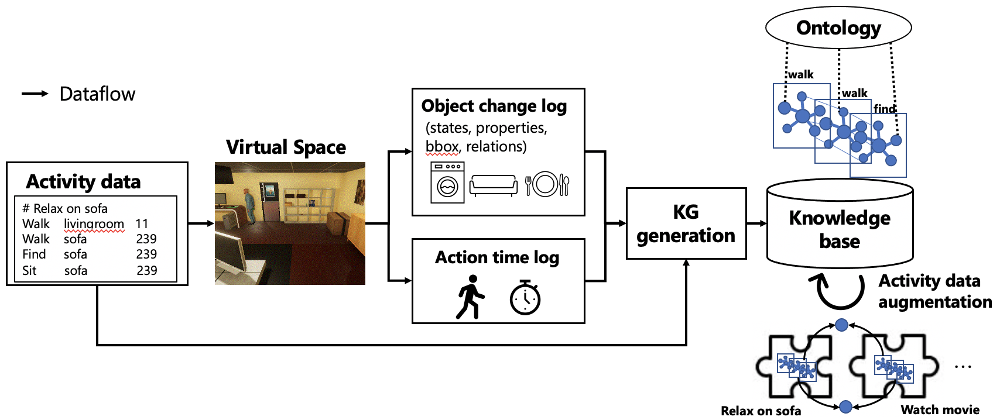

# VirtualHome2KG
VirtualHome2KGは、仮想空間を利用して日常生活行動のナレッジグラフ（KG）を構築し，合成するシステムです．  
仮想空間シミュレーションのプラットフォームとして[VirtualHome](http://virtual-home.org/)を利用しています．したがってこのリポジトリはVirtualHomeの拡張版です．

## 目次
1. [概要](#概要)
2. [Set Up](#set-up)
3. [使用方法](#使用方法)
4. [生成した動画・ナレッジグラフの説明](#生成した動画ナレッジグラフの説明)
<!--5. Knowledge graphs-->

## 概要

社会の高齢化に伴い，家庭内における生活の安全維持，質の向上の重要性が増しています．しかし，データ収集の多くは物理機材や被験者を要し，コストがかかる上に条件変更が難しく，ライセンス上制限が厳しいという問題があります．また，収集データ内に意味的な関係が不足しているため，意味やコンテキストを考慮した分析が困難です．  

我々の長期的な目標は，家庭内の日常生活の様々なコンテキストを理解し，様々な状況で人間の行動や意思決定を支援するAIを，ソフトウェアエージェントやロボットなどの形で具現化することです．近年，三次元環境内でナビゲーションを伴うVisual Question Answering (VQA)を行うAI分野のタスクである，Embodied Question Answering (EQA)が注目されています．特に，これらの研究におけるデータセットとしてシーングラフやナレッジグラフの構築が注目されています．もし物理空間の環境を仮想空間上で再現し，様々なシミュレーションを施行できれば，日常生活の分析やVQAやEQAのためのモデルの構築に必要なデータを収集できると考えています．  

VirtualHome2KGは下図のように，家庭内の日常生活を表すKGを仮想空間を用いて合成することで，データや知識不足によりこれまで行うことが困難だった，コンテキストを捉えたデータ分析や様々なアプリケーションの開発を可能にします．



## バージョン
- [Beta version](https://github.com/aistairc/VirtualHome2KG/):  イベント中心スキーマ (SWO研究会, under review)
- [stable version](https://github.com/aistairc/VirtualHome2KG/tree/bcfa5b7b06af046c70d7d41c454ad7f9610ecbd2): アクション中心の古いスキーマ (ISWC2021 Poster, ICTAI2021 Short paper)

## Set Up

```bash
git clone https://github.com/aistairc/virtualhome2kg.git
```
VirtualHome2KGは[Jupyter](https://jupyter.org/) notebooksで使用できます. 事前にJupyterのインストールが必要です．

環境構築
```bash
pip install -r requirements.txt
```
次に，VirtualHome Unity Simulaterをダウンロードし，`simulation/` (for MacOS) or `simulation/unity_simulator` (Windows)に配置してください．  
[Download Unity Simulator
](https://github.com/xavierpuigf/virtualhome/blob/master/README.md#download-unity-simulator)  
※VirtualHome2KGではVirtualHome Simulatorのバージョン2.2.4を使用しています．最新の2.3では正常に動かない可能性があります．
- [2.2.4 (linux)](http://virtual-home.org//release/simulator/v2.0/v2.2.4/linux_exec.zip)
- [2.2.4 (mac)](http://virtual-home.org/release/simulator/v2.0/v2.2.4/macos_exec.zip)
- [2.2.4 (windows)](http://virtual-home.org//release/simulator/v2.0/v2.2.4/windows_exec.zip)

実験環境:  
Local machine  
- Python: anaconda3-2020.07
- PC: MacBook Pro (13-inch, 2020, Four Thunderbolt 3 ports)
- OS: macOS Catalina (10.15.7)
- CPU: 2.3 GHz Quad core Intel Core i7
- Memory: 32GB 3733 MHz LPDDR4X
- GPU: Intel Iris Plus Graphics 1536 MB
  
Server  
- Triplestore: GraphDB SE 9.6 by Ontotext
- OS: Windows 10 for Workstation
- CPU: Xeon Gold 5215L 10 cores
- Memory: 2.15TB

## 使用方法

### 準備
シミュレーションするシナリオ（program）を用意します．
- 手元で用意したシナリオを用意する場合
  - [こちら](https://github.com/xavierpuigf/virtualhome/blob/v2.2.0/dataset/README.md#programs)のフォーマットに従って作成してください．
- 提供されているデータセットを使用する場合
  -  我々が用意したprogram例を[こちら](https://github.com/KnowledgeGraphJapan/KGRC-RDF/tree/kgrc4si/Program)で公開しています．ダウンロードして，`dataset/`フォルダに配置してください．<b>※Unityシミュレータで正しく実行できることを確認しており，出力結果を下記で提供しています。[VirtualHome2KGデータセット―家庭内の日常生活行動のシミュレーション動画とナレッジグラフ―](https://github.com/KnowledgeGraphJapan/KGRC-RDF/blob/kgrc4si/extended_readme.md)</b>
  - VirtualHomeのアクティビティに基づいてナレッジグラフを生成する場合は[dataset](https://github.com/xavierpuigf/virtualhome/blob/v2.2.0/README.md#dataset)をダウンロードしてください． <b>※ただし，Unityシミュレータで正しく実行できることは保証されていません</b>

### シミュレーションと結果の出力
1. ダウンロードして配置したUnityシミュレーターを起動します．

2. スクリプトを実行します．
- アクティビティグラフを生成するためのスクリプトを2種類提供しています（※アクティビティグラフは知識グラフではないことに注意してください。これはシミュレーション結果をJSON形式で記述したものです)。
  - 1つ目は，オブジェクトの3D座標とアクションの実行時間を記録せずに状態変化のみをシミュレーションして，アクティビティグラフを生成します．このスクリプトは，Unityシミュレータ上でレンダリングを行わずに[Graph Evolve Simulator](https://github.com/xavierpuigf/virtualhome/tree/v2.2.0/simulation)でシミュレーションを行い，短時間で多くのデータを生成することが可能です．  
  Jupyter notebook:  
  run [demo/generate_activitiy_graph.ipynb](demo/generate_activity_graph.ipynb)
  - 2つ目は，3D座標と実行時間を含むアクティビティグラフを生成するものです．このバージョンでは、Unityシミュレータを使用してシミュレーションを行うため，データの生成に多くの時間がかかります．また，シミュレーションの実行可否は，VirtualHomeのUnityシミュレータに依存します．  
  Jupyter notebook:  
  run [demo/generate_activitiy_graphi_with_bbox.ipynb](demo/generate_activity_graph_with_bbox.ipynb)

### ナレッジグラフの生成
<!--Script:  
```bash
cd scripts
python create_rdf.py [activity name (folder name of the simulation results)]
```-->
シミュレーション結果を生成した後に，下記のJupyter notebookを実行します．

1. レンダリングを伴わないシミュレーションの場合  
run [demo/create_rdf_r3.ipyb](demo/create_rdf_r3.ipynb)
  
2. レンダリングを伴うシミュレーションの場合  
run [demo/create_rdf_r3_bbox.ipyb](demo/create_rdf_r3_bbox.ipynb)

#### 部屋の移動情報の追加
上記を実行後に適切なトリプルストアに格納し，下記を実行します．  
※SPARQLエンドポイント情報はご自身で設定が必要です．  
run [demo/add_places.ipynb](demo/add_places.ipynb)

### ナレッジグラフの拡張
より長い時間帯で日常生活を分析するためには，単体のアクティビティデータだけでなく，それらを連続的に行ったシナリオのデータが必要です．そこで，アクティビティ間の遷移確率を算出し，マルコフ連鎖によりアクティビティの系列を生成します．これを基に，各アクティビティのKGを，前提状況や事後状況に矛盾を生じさせずに結合することで，複数のアクティビティを連続的に行うシナリオデータ（エピソード）のKGを生成する手法を提案します．

クラウドソーシングで収集した日常生活の順序データをデータセットフォルダに移動します。
```bash
mv demo/lancers_task.csv dataset/
```

マルコフ連鎖でエピソードの雛形を確率的に作成します．  
run [demo/markov_chain.ipynb](https://github.com/aistairc/VirtualHome2KG/blob/main/demo/markov_chain.ipynb)

エピソードのRDFを生成します．  
※SPARQLエンドポイントはご自身の環境のものを利用してください．  
run [demo/create_episode_rdf.ipynb](https://github.com/aistairc/VirtualHome2KG/blob/main/demo/create_episode_rdf.ipynb)

## 生成した動画・ナレッジグラフの説明
[こちら](https://github.com/KnowledgeGraphJapan/KGRC-RDF/blob/kgrc4si/extended_readme.md#%E6%8F%90%E6%A1%88%E3%83%87%E3%83%BC%E3%82%BF%E3%82%BB%E3%83%83%E3%83%88)をご覧ください．

## Publications
### 査読付き学術論文誌

Egami, S.. Ugai, T., Oono, M., Kitamura, K., Fukuda.: Synthesizing Event-centric Knowledge Graphs of Daily Activities using Virtual Space. IEEE Access, Early Access. doi: [https://doi.org/10.1109/ACCESS.2023.3253807](https://doi.org/10.1109/ACCESS.2023.3253807) (2023)

### 査読付き国際会議

Egami, S., Nishimura, S., Fukuda, K.: A Framework for Constructing and Augmenting Knowledge Graphs using Virtual Space: Towards Analysis of Daily Activities. Proceedings of the 33rd IEEE International Conference on Tools with Artificial Intelligence. pp.1226-1230 (2021) [[IEEE Xplore]](https://ieeexplore.ieee.org/document/9643400)

Egami, S., Nishimura, S., Fukuda, K.: VirtualHome2KG: Constructing and Augmenting Knowledge Graphs of Daily Activities Using Virtual Space. Proceedings of the ISWC 2021 Posters, Demos and Industry Tracks: From Novel Ideas to Industrial Practice, co-located with 20th International Semantic Web Conference. CEUR, Vol.2980 (2021) [[pdf]](http://ceur-ws.org/Vol-2980/paper381.pdf)

### 国内研究会

江上周作，鵜飼孝典，窪田文也，大野美喜子，北村光司，福田賢一郎: 家庭内の事故予防に向けた合成ナレッジグラフの構築と推論，第56回人工知能学会セマンティックウェブとオントロジー研究会, SIG-SWO-056-14 (2022) [[J-STAGE]](https://www.jstage.jst.go.jp/article/jsaisigtwo/2022/SWO-056/2022_14/_article/-char/ja)

## ライセンス
[MIT License](LICENSE)

## 謝辞
この成果は，国立研究開発法人新エネルギー・産業技術総合開発機構(NEDO)の委託業務(JPNP20006, JPNP180013)の結果得られたものです．
